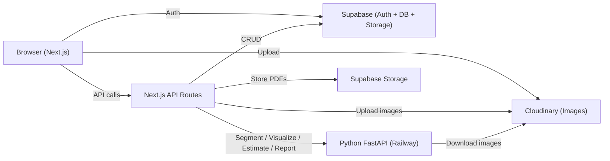

# RenovateAI — Exterior House Renovation & Cost Estimation System

An AI-powered full-stack application for visualizing exterior house renovations and generating accurate cost estimates. Upload a house photo, let AI detect architectural regions, apply premium materials, preview the result, and download a detailed PDF report.

## Architecture



## Tech Stack

| Layer | Technology |
|-------|-----------|
| Frontend & Backend | Next.js 14 (App Router, TypeScript) |
| Auth | Supabase Auth (email/password + Google OAuth) |
| Database | Supabase PostgreSQL with Row Level Security |
| Image Hosting | Cloudinary (originals, redesigned, textures) |
| File Storage | Supabase Storage (private PDF reports) |
| AI Segmentation | Python FastAPI microservice (SAM2 / mock fallback) |
| Visualization | Cloudinary Transformations + Pillow |
| PDF Reports | ReportLab |
| Styling | Tailwind CSS + shadcn/ui |
| State Management | Zustand |
| Deployment | Vercel (Next.js) + Railway (Python) |

## Local Development Setup

### Prerequisites

- Node.js 18+
- Python 3.10+
- Supabase CLI (`npm install -g supabase`)
- A Supabase project (free tier works)
- A Cloudinary account (free tier works)

### 1. Clone and Install

```bash
cd renovation-system
npm install
```

### 2. Environment Variables

Copy `.env.local` and fill in your values:

| Variable | Description |
|----------|-------------|
| `NEXT_PUBLIC_SUPABASE_URL` | Your Supabase project URL |
| `NEXT_PUBLIC_SUPABASE_ANON_KEY` | Supabase anonymous/public key |
| `SUPABASE_SERVICE_ROLE_KEY` | Supabase service role key (server-side only) |
| `NEXT_PUBLIC_CLOUDINARY_CLOUD_NAME` | Your Cloudinary cloud name |
| `CLOUDINARY_API_KEY` | Cloudinary API key |
| `CLOUDINARY_API_SECRET` | Cloudinary API secret |
| `NEXT_PUBLIC_CLOUDINARY_UPLOAD_PRESET` | Unsigned upload preset name (e.g. `renovation_unsigned`) |
| `PYTHON_SERVICE_URL` | URL of the Python microservice (e.g. `http://localhost:8000`) |
| `PYTHON_SERVICE_SECRET` | Shared secret for Python service authentication |

### 3. Supabase Setup

```bash
# Start local Supabase (optional)
supabase start

# Run migrations
supabase db push

# Or manually run in Supabase SQL editor:
# 1. supabase/migrations/001_initial_schema.sql
# 2. supabase/migrations/002_rls_policies.sql
# 3. supabase/migrations/003_seed_materials.sql
```

Create a Storage bucket named `reports` (private) in your Supabase dashboard.

### 4. Cloudinary Setup

1. Create an unsigned upload preset named `renovation_unsigned`
2. Allowed formats: jpg, png, webp
3. Max file size: 20MB
4. Auto-tag with "renovation"

### 5. Python Microservice

```bash
cd python-service
python -m venv venv

# Windows
venv\Scripts\activate
# macOS/Linux
source venv/bin/activate

pip install -r requirements.txt
```

#### AI Segmentation (Roboflow API)

The service uses the Roboflow cloud API for detecting architectural regions — no local model or GPU needed:

1. Create a free account at [roboflow.com](https://roboflow.com)
2. Use an existing instance segmentation model (search the [Roboflow Universe](https://universe.roboflow.com) for "building segmentation" or "house exterior") or train your own
3. Set these env vars for the Python service:
   - `ROBOFLOW_API_KEY` — your Roboflow API key (Settings > API Key)
   - `ROBOFLOW_MODEL_ID` — your model ID in the format `project-name/version` (e.g. `building-segmentation/1`)
4. Free tier gives 1,000 inferences/month
5. Falls back to mock segmentation (5 predefined regions) if the API key is not set

```bash
# Start the Python service
uvicorn main:app --reload --port 8000
```

### 6. Start Next.js Dev Server

```bash
npm run dev
```

Visit `http://localhost:3000`

## Deployment

### Next.js → Vercel

1. Push to GitHub
2. Import in Vercel
3. Set all environment variables in Vercel project settings
4. Deploy

### Python Microservice → Railway

1. Push `python-service/` to a separate repo (or use monorepo)
2. Create new Railway project
3. Set environment variables: `SERVICE_SECRET`
4. Railway auto-detects the `Procfile`
5. Copy the deployed URL to `PYTHON_SERVICE_URL` in Vercel

## Project Structure

```
renovation-system/
├── app/                          # Next.js App Router
│   ├── layout.tsx                # Root layout with fonts
│   ├── page.tsx                  # Landing page
│   ├── auth/                     # Login, signup, OAuth callback
│   ├── dashboard/                # User's projects list
│   ├── project/[projectId]/      # 6-step project wizard
│   └── api/                      # API routes
├── components/                   # React components
│   ├── ui/                       # shadcn/ui primitives
│   ├── Navbar.tsx
│   ├── ProjectStepper.tsx
│   ├── ImageUploader.tsx
│   ├── SegmentationViewer.tsx
│   ├── MaterialCatalog.tsx
│   ├── VisualizationPanel.tsx
│   ├── CostBreakdown.tsx
│   └── ReportDownloader.tsx
├── lib/                          # Utilities
│   ├── supabase/                 # Supabase client helpers
│   ├── cloudinary.ts             # Cloudinary helpers
│   ├── types.ts                  # TypeScript types
│   └── utils.ts                  # cn() helper
├── store/
│   └── projectStore.ts           # Zustand store
├── python-service/               # FastAPI microservice
│   ├── main.py
│   ├── services/                 # Business logic
│   └── routers/                  # API endpoints
└── supabase/
    └── migrations/               # SQL migrations
```

## How the Estimation Works

The system uses a multi-stage pipeline to convert a house photo into a cost estimate:

### 1. Surface Area Estimation

After AI segmentation identifies regions (walls, windows, balconies, etc.), each region is represented as a polygon with normalized coordinates (0–1 range).

- **Shoelace formula**: The area of each polygon is calculated in pixels using the [shoelace formula](https://en.wikipedia.org/wiki/Shoelace_formula), which computes the area of any simple polygon from its vertex coordinates.
- **Pixel-to-sqft conversion**: Pixel area is converted to square feet using a `pixels_per_foot` ratio (default: 10 px/ft). This is an approximation based on typical residential photo perspectives.
- **Optional calibration**: Users can provide a custom `pixels_per_foot` value via the "Calibrate Measurements" button in the Cost Estimate step. For example, if you know a door in the image is 7 feet tall and it spans 100 pixels, set pixels per foot to ~14.3 for more accurate results.

### 2. Material Quantity Calculation

For each region with an assigned material:

```
quantity = area_sqft / coverage_per_unit
```

- `coverage_per_unit` comes from the materials table. For paint, 1 litre covers ~120 sqft; for tiles/cladding, coverage is 1 sqft per unit.
- Railings use `linear_ft` — the polygon perimeter is used instead of area.

### 3. Cost Calculation

For each region:

```
material_cost = quantity × material_rate_per_unit
labor_cost    = quantity × labor_rate_per_unit
total_cost    = material_cost + labor_cost
```

Rates come from the materials table but can be overridden per-project by the user (inline editing in the cost table).

### 4. Wastage & Grand Total

```
subtotal      = sum of all line item totals
wastage       = subtotal × (wastage_percent / 100)
grand_total   = subtotal + wastage
```

The default wastage is 12%, which is editable by clicking the wastage badge on the Grand Total card.

### 5. Assumptions

- The building is photographed from a roughly frontal perspective
- Standard residential proportions are assumed (ceiling height ~10 ft)
- Area estimates are approximate — pixel-based measurement has inherent limitations from camera angle, lens distortion, and distance
- Cost estimates are advisory and not legally binding

## Known Limitations

- **Area estimation accuracy**: Pixel-to-sqft conversion uses an approximate ratio. For precise estimates, calibration with known dimensions is recommended.
- **Single-photo constraint**: The system works with one exterior photo per project. Multiple angles are not yet supported.
- **Segmentation speed**: Roboflow API calls take 1-3 seconds. Mock mode is instant. Free tier is limited to 1,000 inferences/month.
- **Material textures**: Texture overlay uses basic alpha blending. Perspective correction is approximate.
- **PDF report**: Images are embedded at web resolution. High-DPI printing may show reduced quality.
