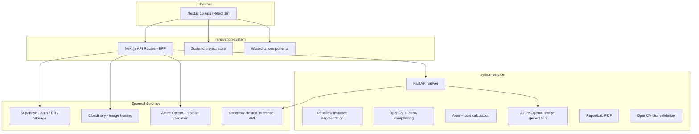

# RenovateAI — Frontend (Next.js)

AI-powered exterior house renovation and cost estimation UI. Users upload a house photo, detect architectural regions with **Roboflow** instance segmentation, assign materials, preview an AI redesign, and download a PDF cost report.

This folder is the **Next.js app**. The Python backend lives in the sibling directory [`../python-service/`](../python-service/). See the [root README](../README.md) for the full monorepo overview.

## Architecture



## Tech Stack

| Layer | Technology |
|-------|-----------|
| Frontend | Next.js 16 (App Router), React 19, TypeScript |
| Styling | Tailwind CSS 4, shadcn/ui |
| State | Zustand (`store/projectStore.ts`) |
| Auth & DB | Supabase Auth (email + Google OAuth), PostgreSQL + RLS |
| Images | Cloudinary (originals, textures, redesigned previews) |
| Reports | Supabase Storage (private PDF bucket) |
| Segmentation | **Roboflow** hosted API via `python-service` (mock fallback when keys are unset) |
| Visualization | Python: Pillow + OpenCV compositing over detected polygons |
| AI redesign | Azure OpenAI (`gpt-image` deployment) via `python-service` |
| Upload validation | Azure OpenAI (building check) + Python blur detection |
| PDF reports | ReportLab in `python-service` |
| Backend | FastAPI in [`../python-service/`](../python-service/) |

> **Note:** We do **not** run SAM/SAM2 locally. Segmentation is handled by a custom Roboflow instance-segmentation model (`house-parts/1` or your own `ROBOFLOW_MODEL_ID`). See [Why Roboflow?](#why-roboflow-not-sam) below.

## Project Workflow (6 Steps)

| Step | UI | What happens |
|------|-----|----------------|
| 1 | Upload | Image → Cloudinary; blur check (Python); building validation (Azure) |
| 2 | Detect Regions | Roboflow segmentation → editable polygons in `SegmentationViewer` |
| 3 | Choose Materials | Assign catalog materials per region |
| 4 | Visualize | Material overlay + optional Azure AI photorealistic polish |
| 5 | Cost Estimate | Shoelace area → quantity → material + labor (INR) |
| 6 | Download Report | PDF generated by Python, stored in Supabase Storage |

## Local Development

### Prerequisites

- Node.js 18+
- Python 3.10+ (for `python-service`)
- Supabase project (Auth, DB, Storage)
- Cloudinary account
- Roboflow API key + model ID (optional — mock regions used if missing)
- Azure OpenAI (optional — required for upload validation and AI redesign)

### 1. Install frontend dependencies

```bash
cd renovation-system
npm install
```

### 2. Environment variables (`.env.local`)

| Variable | Description |
|----------|-------------|
| `NEXT_PUBLIC_SUPABASE_URL` | Supabase project URL |
| `NEXT_PUBLIC_SUPABASE_ANON_KEY` | Supabase anon/public key |
| `SUPABASE_SERVICE_ROLE_KEY` | Service role key (server routes only) |
| `NEXT_PUBLIC_CLOUDINARY_CLOUD_NAME` | Cloudinary cloud name |
| `CLOUDINARY_API_KEY` | Cloudinary API key |
| `CLOUDINARY_API_SECRET` | Cloudinary API secret |
| `NEXT_PUBLIC_CLOUDINARY_UPLOAD_PRESET` | Unsigned preset (e.g. `renovation_unsigned`) |
| `PYTHON_SERVICE_URL` | FastAPI base URL (e.g. `http://localhost:8000`) |
| `PYTHON_SERVICE_SECRET` | Shared secret (`SERVICE_SECRET` on Python side) |
| `AZURE_OPENAI_ENDPOINT` | Azure OpenAI endpoint |
| `AZURE_OPENAI_API_KEY` | Azure API key |
| `AZURE_OPENAI_DEPLOYMENT` | Chat deployment for image validation |

Python service variables (`ROBOFLOW_API_KEY`, `ROBOFLOW_MODEL_ID`, `AZURE_OPENAI_IMAGE_DEPLOYMENT`, etc.) go in [`../python-service/.env`](../python-service/.env).

### 3. Supabase setup

```bash
# From renovation-system/
supabase db push
```

Or run migrations manually in the SQL editor:

1. `supabase/migrations/001_initial_schema.sql`
2. `supabase/migrations/002_rls_policies.sql`
3. `supabase/migrations/003_seed_materials.sql`
4. `supabase/migrations/004_ai_designed_column.sql`

Create a **private** Storage bucket named `reports` in the Supabase dashboard.

### 4. Cloudinary setup

1. Create an unsigned upload preset (e.g. `renovation_unsigned`)
2. Allowed formats: JPG, PNG, WebP
3. Max file size: 20 MB

### 5. Start the Python backend

```bash
cd ../python-service
python -m venv venv
venv\Scripts\activate          # Windows
# source venv/bin/activate     # macOS/Linux
pip install -r requirements.txt
# Configure .env with ROBOFLOW_*, SERVICE_SECRET, AZURE_OPENAI_*, etc.
uvicorn main:app --reload --port 8000
```

#### Roboflow segmentation

1. Sign up at [roboflow.com](https://roboflow.com)
2. Use a Universe model (e.g. building/house exterior segmentation) or train your own instance-segmentation model
3. Set in `python-service/.env`:
   - `ROBOFLOW_API_KEY` — Settings → API Key
   - `ROBOFLOW_MODEL_ID` — `project-name/version` (e.g. `house-parts/1`)
4. Without these keys, the API returns **mock regions** (5 predefined polygons) for local development

### 6. Start Next.js

```bash
cd renovation-system
npm run dev
```

Open [http://localhost:3000](http://localhost:3000).

## Project Structure

```
E2M task/                          # Monorepo root
├── renovation-system/             # ← You are here (Next.js frontend)
│   ├── app/
│   │   ├── layout.tsx, page.tsx   # Root layout + landing
│   │   ├── auth/                  # Login, signup, OAuth callback
│   │   ├── dashboard/             # User projects list
│   │   ├── project/[projectId]/   # 6-step renovation wizard
│   │   └── api/                   # BFF routes → Supabase / Python / Cloudinary
│   │       ├── upload/            # Cloudinary + blur + Azure validation
│   │       ├── segment/           # → Python /segment (Roboflow)
│   │       ├── save-segments/
│   │       ├── assign-materials/
│   │       ├── visualize/         # → Python /visualize
│   │       ├── ai-design/         # → Python /ai-design
│   │       ├── estimate/          # → Python /estimate
│   │       ├── materials/
│   │       └── report/            # → Python /report + Supabase Storage
│   ├── components/
│   │   ├── ui/                    # shadcn/ui primitives
│   │   ├── Navbar.tsx
│   │   ├── ProjectStepper.tsx
│   │   ├── ImageUploader.tsx
│   │   ├── SegmentationViewer.tsx # Polygon editor + Roboflow results
│   │   ├── MaterialCatalog.tsx
│   │   ├── RegionPreview.tsx
│   │   ├── VisualizationPanel.tsx
│   │   ├── CostBreakdown.tsx
│   │   └── ReportDownloader.tsx
│   ├── lib/
│   │   ├── api/                   # Client helpers (segments, estimate, …)
│   │   ├── supabase/              # Browser, server, middleware clients
│   │   ├── cloudinary.ts
│   │   ├── azure-vision.ts        # Building / exterior validation
│   │   ├── types.ts
│   │   └── utils.ts
│   ├── store/
│   │   └── projectStore.ts        # Zustand: segments, materials, costs
│   ├── middleware.ts              # Supabase session refresh
│   └── supabase/migrations/       # SQL schema + seed data
│
└── python-service/                # FastAPI backend (sibling repo folder)
    ├── main.py
    ├── routers/                   # segment, visualize, estimate, report, validate, ai_design
    ├── services/
    │   ├── sam_service.py         # Roboflow client (historical filename)
    │   ├── visualization_service.py
    │   ├── area_service.py, cost_service.py
    │   ├── ai_polish_service.py
    │   ├── report_service.py
    │   └── validation_service.py
    └── schemas/
```

## API Routes (BFF)

| Route | Proxies to |
|-------|------------|
| `POST /api/upload` | Cloudinary, `POST /validate/blur`, Azure vision |
| `POST /api/segment` | `POST /segment` (Roboflow) |
| `POST /api/save-segments` | Supabase `projects.segmentation_data` |
| `POST /api/visualize` | `POST /visualize` |
| `POST /api/ai-design` | `POST /ai-design` |
| `POST /api/estimate` | `POST /estimate` |
| `POST /api/report` | `POST /report` → Supabase Storage |

All Python calls send the `x-service-secret` header matching `PYTHON_SERVICE_SECRET` / `SERVICE_SECRET`.

## How Estimation Works

### 1. Surface area

After Roboflow (or mock) segmentation, each region has a normalized polygon (`mask_polygon`, 0–1 coordinates).

- **Shoelace formula** — pixel area from vertices
- **pixels_per_foot** — default `10`; user can calibrate in the Cost Estimate step
- **Railings** — perimeter used as `linear_ft` instead of area

### 2. Material quantity

```
quantity = area_sqft / coverage_per_unit
```

Coverage comes from the `materials` table (seeded in migration `003`).

### 3. Cost per region

```
material_cost = quantity × material_rate_per_unit
labor_cost    = quantity × labor_rate_per_unit
total         = material_cost + labor_cost
```

Rates can be overridden per project in the UI. Currency: **INR**.

### 4. Wastage

```
grand_total = subtotal + subtotal × (wastage_percent / 100)
```

Default wastage: **12%** (editable in UI).

## Why Roboflow (Not SAM)

We evaluated **SAM2** for zero-shot masks but ruled it out for this stack:

- Needs GPU (~8 GB VRAM) for practical latency
- ~2.5 GB weights exceed typical serverless limits
- CPU inference is too slow for an interactive wizard

**Roboflow hosted inference** fits our deployment model:

- REST API — no GPU to host
- Custom `house-parts` instance-segmentation model with polygon outputs
- Free tier for development; mock fallback when keys are absent

Implementation: [`python-service/services/sam_service.py`](../python-service/services/sam_service.py) (calls `https://detect.roboflow.com/{model_id}`).

## Deployment

### Next.js → Vercel

1. Import `renovation-system/` as the project root (or monorepo subpath)
2. Set all `.env.local` variables in Vercel
3. Set `PYTHON_SERVICE_URL` to your deployed FastAPI URL

### Python → Vercel or Railway

- **Vercel:** `python-service/vercel.json` is included (`@vercel/python`)
- **Railway / other:** run `uvicorn main:app` with the same env vars

Ensure `PYTHON_SERVICE_URL` on the frontend points to the live Python base URL.

## Known Limitations

- **Area accuracy** — Pixel-to-sqft is approximate; calibrate with a known dimension when possible
- **Single photo** — One exterior image per project
- **Roboflow quota** — Free tier ~1,000 inferences/month; API latency ~1–3 s
- **Fixed region classes** — Depends on your Roboflow model’s label set
- **AI redesign** — Azure image generation may alter fine architectural detail
- **Exterior only** — Upload validation rejects non-building images

## License

Developed as part of the E2M task assignment.
